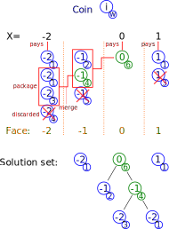

# Package-merge algorithm Common Lisp implementation
We implemented the package-merge algorithm [1] for solving the Coin Collector 
problem. This is mainly a (hopefully clear) write-up
of the details of the package-merge algorithm for the sake of documentation.

This is linked to the problem of length-limited Huffman coding, but we just
limit ourselves to the Coin Collector problem here for the sake of clarity.

⚠⚠⚠ The implementation is for the sake of testing and research. Better
algorithms have been published for solving the length-limited Huffman coding
problem with better space performance [2]. Please ponder a while before using
this in production as is. ⚠⚠⚠

## Problem presentation
[1] introduces the (binary) "Coin Collector's problem". A numismat has run out
of money and must pay for his groceries with his coin collection. Each coin has
a face value and a numismatic value. The numismat wants to find the set of coins
that have a given total face value while minimizing the total numismatic value.

The coins can only have face values in (possibly negative) powers of two. The
problem is then suited to finding sets of coins amounting to total sums _X_ that
are easily decomposed in a sum of powers of two.

Let us represent coins by the pair: (_i_, _w_).
* _i_: The coin has face value 2^i.
* _w_: Weight of the coin, its numismatic value.

We can state the problem more formally. We want to find, for a given set of
pairs (_i_, _w_), the subset whose sum of _2^i_ equals X while minimizing the
sum of _w_.

## Algorithm explanation
(The Binary Coin Collector can actually be solved in intuitive ways. You can
think about how you would proceed were you in the coin collector's shoes and
find a good procedure. Solution is below if you lack the patience :) )

Two slightly different ways of looking at the solving procedure are given in [1]
: a recursive and non-recursive one. We also give the intuitive idea behind the
algorithm, which could maybe elude the readers of [1].

### General intuitive idea
Let us take a particular problem defined by:
* The coins with face values _2^i_ and numismatic values _w_:

| | | | | | | | | |
| ------- | --- | --- | --- | --- | --- | --- | --- | --- |
| coin id | 0  | 1  | 2  | 3  | 4  | 5  | 6 | 7 |
| face    | -2 | -2 | -2 | -2 | -1 | -1 | 1 | 1 |
| weight  | 1  | 1  | 3  | 4  | 2  | 5  | 1 | 3 |

* The sum _X_ to pay and its diadic expansion terms _k_. _X = Sum(2^k)_.

| | | | |
| --- | --- | --- | --- |
| k | -2 | 0 | 1 |

To solve the problem, we must find the subset of coins that pays for X exactly
while minimizing the total weight. The solution can be expressed by a series of
coin ids, defined in the table above. Duplicates aren't allowed of course. There
can be either no solution, or one optimal solution, or many optimal solutions
(take the case of many identical coins for example).

Let us explain in a practical way the general procedure one can follow to solve
the problem. Imagine you have your coins in front of you on a table.
1. Begin by arranging them in groups of the same face values.
1. Then inside those groups, arrange them in non-decreasing order of numismatic
value.
1. Now think of these vectors of coins as stacks. You can pop coins from the end
with lowest numismatic value.
1. Since the diadic expansion of _X_ must be paid exactly, each term must
necessarily be paid by a coin/package belonging to the stack with same face
value.
1. So far so good, we can proceed. Begin with the stack of lowest face value.
1. If there is a term of _X_ of the same value to be paid, then immediatly use 
the coin of least weight (top of the stack) to pay. If you have no coin to do 
this, the coin collector is doomed, there is no solution.
1. In the same stack, begin grouping the coins two by two, in order. This is the
package step of the algorithm. Discard the last odd coin if there is any.
1. You now have packages of coins that have the same face value as the coins of
the next stack, and a numismatic value that is the sum of that of the two coins
that compose the package.
1. You can insert, or merge, these packages into the next stack of coins, 
ensuring that the next stack of coins stays ordered by non-decreasing numismatic
value.
1. Repeat from step 6 until you have either paid _X_ in full or reached the 
point where you cannot find a coin/package to pay for a term in its expansion.

The coins/packages that you have used to pay for the terms in the expansion of
_X_ form the optimal solution set for your problem. The coin collector can take
all those coins and use them to pay for the value _X_ while losing the minimum
amount of numismatic value from his collection.

The steps above for the particular problem are summarized in the following
diagram:



In real life, the solution set of coins is trivially processed. But in a
computerized representation of this set, you would probably end up with a set
of coins and packages. The packages are trees, in that they contain coins or
other packages as children. The solution set is then a forest of trees (counting
leaves as trees). You must have a way to gather all the leaves from the forest.

For the present problem, a solution vector of ids is then:

[0 ; 1 ; 2 ; 4 ; 6]

### Recursive point of view
Let us consider:
* A set _I_ of coins.
* A real number _X_. Decomposed in powers of two. This is the total face value
we want to match with a subset of _I_.

We will update _I_ and _X_ throughout the procedure.
* _r_ is the smallest _2^i_ of all the items in _I_. ie the smallest face value
available in _I_.
* _a_ is the coin with smallest numismatic value _w_ out of the coins of face 
value _r_.
* _minwidth_ is the smallest power of two in the decomposition of X.

We call the optimal subset of coins for _I_ and _X_: _S(I,X)_.

There are four cases:
1. _r > minwidth_: **No solution**. Our smallest coin in face value is too big
to cover the smallest power of two in _X_.
1. _r = minwidth_: _S(I,X) = S(I - {a}, X - r) U {a}_. In other words, we use
the coin to pay for the part _r_ of _X_. The solution set to our problem is
then, recursively, _{a}_ plus the solution set to the problem with _r_ paid for 
in _X_ and without the coin _a_ in _I_.
1. _r < minwidth_ and _a_ is the sole coin of value _r_: 
_S(I,X) = S(I - {a}, X)_. In other words, throw away coin _a_. Its face value is
too low to pay for _r_ and it cannot be combined with other coins. Solve the
problem without _{a}_ in _I_.
1. _r < minwidth_ and there are at least two items with value _r_ in _I_. Take
_a_ and _a'_ the two coins of value _r_ with smallest _w_. Form a **package**
_b_. The face value and numismatic value of _b_ are the sum of that of _a_ and
_a'_. The solution is then recursively _S(I - {a, a'} U {b}, X)_ (if we allow
_b_ to be part of the solution set and we know it is a package of {a, a'}).
Explained simply, we form a package with the two coins of smallest numismatic
value and include it in _I_, treating it as a new virtual coin, after removing 
the two original coins.

And terminations:
* If _X = 0_, then _S(I,X)_ is empty.
* If _X > 0_ and _I_ is empty then there is **no solution**.

### Non-recursive point of view
We arrange the set of coins I in subsets _Ld_ according to their face value
_2^d_. The sets _Ld_ are sorted by non-decreasing weights. Let _S_ be an optimal
solution set of the problem. _S_ is empty at the start of the algorithm.
We alter very slightly the formulation of [1] so as
to make things clearer (in our view).
The algorithm goes as follows:

* Loop while _X > 0_
  * _minwidth_ = smallest _2^d_ term in the diadic expansion of _X_.
  * Find _d_, the minimum _d_ such that _Ld_ is non-empty. If it doesn't exist 
then there is **no solution**.
  * _r = 2^d_.
  * if _r > minwidth_ then **no solution**.
  * else if _r = minwidth_.
    * Pop the minimum weight item from _Ld_ and insert it in _S_.
    * _X = X - minwidth_.
  * end if
  * _Pd+1 = PACKAGE(Ld)_.
  * Discard _Ld_.
  * _Ld+1 = MERGE(Pd+1, Ld+1)_.
* S is an optimal solution.

PACKAGE and MERGE refer to the following operations:
  * PACKAGE: Form the list _Pd+1_ by combining consecutive pairs of coins in the
set _Ld_, with coins ranked from smallest weight to greatest. If there is a
heaviest coin left alone at the end of the operation, it is simply discarded.
  * MERGE: Merge _Pd+1_ into the next set _Ld+1_, while maintaining the
non-decreasing weight order.

## Dependencies
The recursive version depends on https://github.com/thomashoullier/cl-binheap.

## Usage
Let us solve the example case we introduced above:

```common-lisp
(let ((faces #(-2 -2 -2 -2 -1 -1 1 1))
      (weights #(1 1 3 4 2 5 1 3))
      (X #(1 0 -2)))
  (pm:pm-nonrec faces weights X))
;=> #(0 4 1 2 6)
```

* `faces`: The set of `i` in _2^i_ of the face values. Can be in any order but 
must correspond to the order in `weights`.
* `weights`: The set of weights or numismatic value of each coin. Can be any
type (double-float, fixnum etc).
* `X`: The diadic expansion of X given by the `i` in _2^i_. Must be ordered in
decreasing order.

The result is given as the positions in `faces` and `weights` of the coins that
compose the optimal solution set to the Coin Collector problem.

The interface of `pm:pm-rec` is exactly the same.

## Performance
No particular care was taken to improve the performance of these
implementations. It can be noted that, running on large problems, the
non-recursive implementation is faster by a factor of 3-4.
Running `performance.lisp` on my machine looks like:

```common-lisp
Recursive:
Evaluation took:
  0.365 seconds of real time
  0.364984 seconds of total run time (0.359902 user, 0.005082 system)
  100.00% CPU
  1,316,309,616 processor cycles
  27,166,160 bytes consed
  
Non-recursive:
Evaluation took:
  0.079 seconds of real time
  0.078899 seconds of total run time (0.077928 user, 0.000971 system)
  100.00% CPU
  284,733,900 processor cycles
  16,741,984 bytes consed
```

There are steps that could be taken to make the recursive implementation faster,
but readability would be greatly diminished. The goal of these implementations
being mainly documentation and test reference, I won't go further.

## References
1. Larmore, Lawrence L., and Daniel S. Hirschberg. "A fast algorithm for optimal length-limited Huffman codes." Journal of the ACM (JACM) 37.3 (1990): 464-473. https://doi.org/10.1145/79147.79150
1. Katajainen, Jyrki, Alistair Moffat, and Andrew Turpin. "A fast and space-economical algorithm for length-limited coding." International Symposium on Algorithms and Computation. Springer, Berlin, Heidelberg, 1995. https://doi.org/10.1007/BFb0015404
